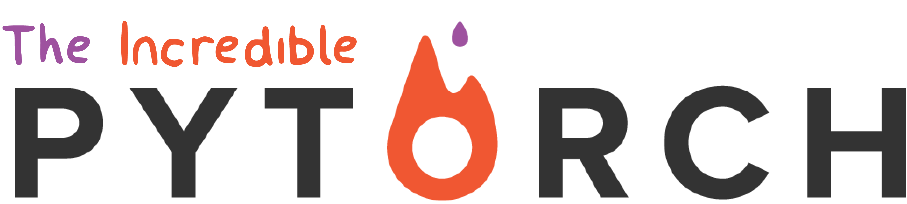

--------------------------------------------------------------------------------

	
	
	

This is a curated list of tutorials, projects, libraries, videos, papers, books and anything related to the incredible [PyTorch](http://pytorch.org/). Feel free to make a pull request to contribute to this list.

# Table Of Contents
<!-- vscode-markdown-toc -->

- [Table Of Contents](#table-of-contents)
	- [Tutorials](#tutorials)
	- [Large Language Models (LLMs)](#large-language-models-llms)
	- [Tabular Data](#tabular-data)
	- [Visualization](#visualization)
	- [Explainability](#explainability)
	- [Object Detection](#object-detection)
	- [Long-Tailed / Out-of-Distribution Recognition](#long-tailed--out-of-distribution-recognition)
	- [Activation Functions](#activation-functions)
	- [Energy-Based Learning](#energy-based-learning)
	- [Missing Data](#missing-data)
	- [Architecture Search](#architecture-search)
	- [Continual Learning](#continual-learning)
	- [Optimization](#optimization)
	- [Quantization](#quantization)
	- [Quantum Machine Learning](#quantum-machine-learning)
	- [Neural Network Compression](#neural-network-compression)
	- [Facial, Action and Pose Recognition](#facial-action-and-pose-recognition)
	- [Super resolution](#super-resolution)
	- [Synthetesizing Views](#synthetesizing-views)
	- [Voice](#voice)
	- [Medical](#medical)
	- [3D Segmentation, Classification and Regression](#3d-segmentation-classification-and-regression)
	- [Video Recognition](#video-recognition)
	- [Recurrent Neural Networks (RNNs)](#recurrent-neural-networks-rnns)
	- [Convolutional Neural Networks (CNNs)](#convolutional-neural-networks-cnns)
	- [Segmentation](#segmentation)
	- [Geometric Deep Learning: Graph \& Irregular Structures](#geometric-deep-learning-graph--irregular-structures)
	- [Sorting](#sorting)
	- [Ordinary Differential Equations Networks](#ordinary-differential-equations-networks)
	- [Multi-task Learning](#multi-task-learning)
	- [GANs, VAEs, and AEs](#gans-vaes-and-aes)
	- [Unsupervised Learning](#unsupervised-learning)
	- [Adversarial Attacks](#adversarial-attacks)
	- [Style Transfer](#style-transfer)
	- [Image Captioning](#image-captioning)
	- [Transformers](#transformers)
	- [Similarity Networks and Functions](#similarity-networks-and-functions)
	- [Reasoning](#reasoning)
	- [General NLP](#general-nlp)
	- [Question and Answering](#question-and-answering)
	- [Speech Generation and Recognition](#speech-generation-and-recognition)
	- [Document and Text Classification](#document-and-text-classification)
	- [Text Generation](#text-generation)
	- [Text to Image](#text-to-image)
	- [Translation](#translation)
	- [Sentiment Analysis](#sentiment-analysis)
	- [Deep Reinforcement Learning](#deep-reinforcement-learning)
	- [Deep Bayesian Learning and Probabilistic Programmming](#deep-bayesian-learning-and-probabilistic-programmming)
	- [Spiking Neural Networks](#spiking-neural-networks)
	- [Anomaly Detection](#anomaly-detection)
	- [Regression Types](#regression-types)
	- [Time Series](#time-series)
	- [Synthetic Datasets](#synthetic-datasets)
	- [Neural Network General Improvements](#neural-network-general-improvements)
	- [DNN Applications in Chemistry and Physics](#dnn-applications-in-chemistry-and-physics)
	- [New Thinking on General Neural Network Architecture](#new-thinking-on-general-neural-network-architecture)
	- [Linear Algebra](#linear-algebra)
	- [API Abstraction](#api-abstraction)
	- [Low Level Utilities](#low-level-utilities)
	- [PyTorch Utilities](#pytorch-utilities)
	- [PyTorch Video Tutorials](#pytorch-video-tutorials)
	- [Community](#community)
	- [To be Classified](#to-be-classified)
	- [Links to This Repository](#links-to-this-repository)
	- [Contributions](#contributions)

<!-- vscode-markdown-toc-config
	numbering=false
	autoSave=true
	/vscode-markdown-toc-config -->
<!-- /vscode-markdown-toc -->

## Tutorials
- [Official PyTorch Tutorials](https://github.com/pytorch/tutorials)
- [Official PyTorch Examples](https://github.com/pytorch/examples)
- [Dive Into Deep Learning with PyTorch](https://github.com/d2l-ai/d2l-en)
- [How to Read Pytorch](https://github.com/davidbau/how-to-read-pytorch)
- [Minicourse in Deep Learning with PyTorch (Multi-language)](https://github.com/Atcold/pytorch-Deep-Learning-Minicourse)
- [Practical Deep Learning with PyTorch](https://github.com/ritchieng/deep-learning-wizard)
- [Deep Learning Models](https://github.com/rasbt/deeplearning-models)
- [C++ Implementation of PyTorch Tutorial](https://github.com/prabhuomkar/pytorch-cpp)
- [Simple Examples to Introduce PyTorch](https://github.com/jcjohnson/pytorch-examples)
- [Mini Tutorials in PyTorch](https://github.com/vinhkhuc/PyTorch-Mini-Tutorials)
- [Deep Learning for NLP](https://github.com/rguthrie3/DeepLearningForNLPInPytorch)
- [Deep Learning Tutorial for Researchers](https://github.com/yunjey/pytorch-tutorial)
- [Fully Convolutional Networks implemented with PyTorch](https://github.com/wkentaro/pytorch-fcn)
- [Simple PyTorch Tutorials Zero to ALL](https://github.com/hunkim/PyTorchZeroToAll)
- [DeepNLP-models-Pytorch](https://github.com/DSKSD/DeepNLP-models-Pytorch)
- [MILA PyTorch Welcome Tutorials](https://github.com/mila-udem/welcome_tutorials)
- [Effective PyTorch, Optimizing Runtime with TorchScript and Numerical Stability Optimization](https://github.com/vahidk/EffectivePyTorch)
- [Practical PyTorch](https://github.com/spro/practical-pytorch)
- [PyTorch Project Template](https://github.com/moemen95/PyTorch-Project-Template)
- [Semantic Search with PyTorch](https://github.com/kuutsav/information-retrieval)

## Large Language Models (LLMs)
- LLM Tutorials
  - [Build a Large Language Model (From Scratch)](https://github.com/rasbt/LLMs-from-scratch)
  - [Hugginface LLM Training Book, a collection of methodologies to help with successful training of large language models](https://github.com/huggingface/llm_training_handbook)
- General
  - [Starcoder 2, family of code generation models](https://github.com/bigcode-project/starcoder2)
  - [GPT Fast, fast and hackable pytorch native transformer inference](https://github.com/pytorch-labs/gpt-fast)
  - [Mixtral Offloading, run Mixtral-8x7B models in Colab or consumer desktops](https://github.com/dvmazur/mixtral-offloading)
  - [Llama](https://github.com/facebookresearch/llama)
  - [Llama Recipes](https://github.com/facebookresearch/llama-recipes)
  - [TinyLlama](https://github.com/jzhang38/TinyLlama)
  - [Mosaic Pretrained Transformers (MPT)](https://github.com/mosaicml/llm-foundry)
  - [VLLM, high-throughput and memory-efficient inference and serving engine for LLMs](https://github.com/vllm-project/vllm)
  - [Dolly](https://github.com/databrickslabs/dolly)
  - [Vicuna](https://github.com/lm-sys/FastChat)
  - [Mistral 7B](https://github.com/mistralai/mistral-src)
  - [BigDL LLM, library for running LLM (large language model) on Intel XPU (from Laptop to GPU to Cloud) using INT4 with very low latency1 (for any PyTorch model)](https://github.com/intel-analytics/BigDL)
  - [Simple LLM Finetuner](https://github.com/lxe/simple-llm-finetuner)
  - [Petals, run LLMs at home, BitTorrent-style, fine-tuning and inference up to 10x faster than offloading](https://github.com/bigscience-workshop/petals)
- Japanese
  - [Japanese Llama](https://github.com/masa3141/japanese-alpaca-lora)
  - [Japanese GPT Neox and Open Calm](https://github.com/hppRC/llm-lora-classification)
- Chinese
  - [Chinese Llamma-2 7B](https://github.com/LinkSoul-AI/Chinese-Llama-2-7b)
  - [Chinese Vicuna](https://github.com/Facico/Chinese-Vicuna)
- Retrieval Augmented Generation (RAG)
  - [LlamaIndex, data framework for your LLM application](https://github.com/run-llama/llama_index)
- Embeddings
  - [ChromaDB, open-source embedding database](https://github.com/chroma-core/chroma)
- Applications
  - [Langchain, building applications with LLMs through composability](https://github.com/langchain-ai/langchain)
- Finetuning
  - [Huggingface PEFT, State-of-the-art Parameter-Efficient Fine-Tuning](https://github.com/huggingface/peft)
- Training
  - [Higgsfield, Fault-tolerant, highly scalable GPU orchestration, and a machine learning framework designed for training models with billions to trillions of parameters](https://github.com/higgsfield-ai/higgsfield)
- Quantization
  - [AutoGPTQ, easy-to-use LLMs quantization package with user-friendly apis, based on GPTQ algorithm](https://github.com/PanQiWei/AutoGPTQ)

## Tabular Data
- [PyTorch Frame: A Modular Framework for Multi-Modal Tabular Learning](https://github.com/pyg-team/pytorch-frame)
- [Pytorch Tabular,standard framework for modelling Deep Learning Models for tabular data](https://github.com/manujosephv/pytorch_tabular)
- [Tab Transformer](https://github.com/lucidrains/tab-transformer-pytorch)
- [PyTorch-TabNet: Attentive Interpretable Tabular Learning](https://github.com/dreamquark-ai/tabnet)
- [carefree-learn: A minimal Automatic Machine Learning (AutoML) solution for tabular datasets based on PyTorch](https://github.com/carefree0910/carefree-learn)

## Visualization
- [Loss Visualization](https://github.com/tomgoldstein/loss-landscape)
- [Grad-CAM: Visual Explanations from Deep Networks via Gradient-based Localization](https://github.com/jacobgil/pytorch-grad-cam)
- [Deep Inside Convolutional Networks: Visualising Image Classification Models and Saliency Maps](https://github.com/utkuozbulak/pytorch-cnn-visualizations)
- [SmoothGrad: removing noise by adding noise](https://github.com/utkuozbulak/pytorch-cnn-visualizations)
- [DeepDream: dream-like hallucinogenic visuals](https://github.com/ProGamerGov/neural-dream)
- [FlashTorch: Visualization toolkit for neural networks in PyTorch](https://github.com/MisaOgura/flashtorch)
- [Lucent: Lucid adapted for PyTorch](https://github.com/greentfrapp/lucent)
- [DreamCreator: Training GoogleNet models for DeepDream with custom datasets made simple](https://github.com/ProGamerGov/dream-creator)
- [CNN Feature Map Visualisation](https://github.com/lewis-morris/mapextrackt)

## Explainability
- [Neural-Backed Decision Trees](https://github.com/alvinwan/neural-backed-decision-trees)
- [Efficient Covariance Estimation from Temporal Data](https://github.com/hrayrhar/T-CorEx)
- [Hierarchical interpretations for neural network predictions](https://github.com/csinva/hierarchical-dnn-interpretations)
- [Shap, a unified approach to explain the output of any machine learning model](https://github.com/slundberg/shap)
- [VIsualizing PyTorch saved .pth deep learning models with netron](https://github.com/lutzroeder/netron)
- [Distilling a Neural Network Into a Soft Decision Tree](https://github.com/kimhc6028/soft-decision-tree)
- [Captum, A unified model interpretability library for PyTorch](https://github.com/pytorch/captum)

## Object Detection
- [MMDetection Object Detection Toolbox](https://github.com/open-mmlab/mmdetection)
- [Mask R-CNN Benchmark: Faster R-CNN and Mask R-CNN in PyTorch 1.0](https://github.com/facebookresearch/maskrcnn-benchmark)
- [YOLO-World](https://github.com/AILab-CVC/YOLO-World)
- [YOLOS](https://github.com/hustvl/YOLOS)
- [YOLOF](https://github.com/megvii-model/YOLOF)
- [YOLOX](https://github.com/Megvii-BaseDetection/YOLOX)
- [YOLOv10](https://github.com/THU-MIG/yolov10)
- [YOLOv9](https://github.com/WongKinYiu/yolov9)
- [YOLOv8](https://github.com/ultralytics/ultralytics)
- [Yolov7](https://github.com/WongKinYiu/yolov7)
- [YOLOv6](https://github.com/meituan/YOLOv6)
- [Yolov5](https://github.com/ultralytics/yolov5)
- [Yolov4](https://github.com/AlexeyAB/darknet)
- [YOLOv3](https://github.com/ultralytics/yolov3)
- [YOLOv2: Real-Time Object Detection](https://github.com/longcw/yolo2-pytorch)
- [SSD: Single Shot MultiBox Detector](https://github.com/amdegroot/ssd.pytorch)
- [Detectron models for Object Detection](https://github.com/ignacio-rocco/detectorch)
- [Multi-digit Number Recognition from Street View Imagery using Deep Convolutional Neural Networks](https://github.com/potterhsu/SVHNClassifier-PyTorch)
- [Whale Detector](https://github.com/TarinZ/whale-detector)
- [Catalyst.Detection](https://github.com/catalyst-team/detection)

## Long-Tailed / Out-of-Distribution Recognition
- [Distributionally Robust Neural Networks for Group Shifts: On the Importance of Regularization for Worst-Case Generalization](https://github.com/kohpangwei/group_DRO)
- [Invariant Risk Minimization](https://github.com/facebookresearch/InvariantRiskMinimization)
- [Training Confidence-Calibrated Classifier for Detecting Out-of-Distribution Samples](https://github.com/alinlab/Confident_classifier)
- [Deep Anomaly Detection with Outlier Exposure](https://github.com/hendrycks/outlier-exposure)
- [Large-Scale Long-Tailed Recognition in an Open World](https://github.com/zhmiao/OpenLongTailRecognition-OLTR)
- [Principled Detection of Out-of-Distribution Examples in Neural Networks](https://github.com/ShiyuLiang/odin-pytorch)
- [Learning Confidence for Out-of-Distribution Detection in Neural Networks](https://github.com/uoguelph-mlrg/confidence_estimation)
- [PyTorch Imbalanced Class Sampler](https://github.com/ufoym/imbalanced-dataset-sampler)

## Activation Functions
- [Rational Activations - Learnable Rational Activation Functions](https://github.com/ml-research/rational_activations)

## Energy-Based Learning
- [EBGAN, Energy-Based GANs](https://github.com/eriklindernoren/PyTorch-GAN/blob/master/implementations/ebgan/ebgan.py)
- [Maximum Entropy Generators for Energy-based Models](https://github.com/ritheshkumar95/energy_based_generative_models)

## Missing Data
 - [BRITS: Bidirectional Recurrent Imputation for Time Series](http://papers.nips.cc/paper/7911-brits-bidirectional-recurrent-imputation-for-time-series)

## Architecture Search
- [EfficientNetV2](https://github.com/lukemelas/EfficientNet-PyTorch)
- [DenseNAS](https://github.com/JaminFong/DenseNAS)
- [DARTS: Differentiable Architecture Search](https://github.com/quark0/darts)
- [Efficient Neural Architecture Search (ENAS)](https://github.com/carpedm20/ENAS-pytorch)
- [EfficientNet: Rethinking Model Scaling for Convolutional Neural Networks](https://github.com/zsef123/EfficientNets-PyTorch)

## Continual Learning
- [Renate, Automatic Retraining of Neural Networks](https://github.com/awslabs/renate)

## Optimization
- [AccSGD, AdaBound, AdaMod, DiffGrad, Lamb, NovoGrad, RAdam, SGDW, Yogi and more](https://github.com/jettify/pytorch-optimizer)
- [Lookahead Optimizer: k steps forward, 1 step back](https://github.com/alphadl/lookahead.pytorch)
- [RAdam, On the Variance of the Adaptive Learning Rate and Beyond](https://github.com/LiyuanLucasLiu/RAdam)
- [Over9000, Comparison of RAdam, Lookahead, Novograd, and combinations](https://github.com/mgrankin/over9000)
- [AdaBound, Train As Fast as Adam As Good as SGD](https://github.com/Luolc/AdaBound)
- [Riemannian Adaptive Optimization Methods](https://github.com/ferrine/geoopt)
- [L-BFGS](https://github.com/hjmshi/PyTorch-LBFGS)
- [OptNet: Differentiable Optimization as a Layer in Neural Networks](https://github.com/locuslab/optnet)
- [Learning to learn by gradient descent by gradient descent](https://github.com/ikostrikov/pytorch-meta-optimizer)
- [Surrogate Gradient Learning in Spiking Neural Networks](https://github.com/fzenke/spytorch)
- [TorchOpt: An Efficient Library for Differentiable Optimization](https://github.com/metaopt/torchopt)

## Quantization
- [Additive Power-of-Two Quantization: An Efficient Non-uniform Discretization For Neural Networks](https://github.com/yhhhli/APoT_Quantization)

## Quantum Machine Learning
- [Tor10, generic tensor-network library for quantum simulation in PyTorch](https://github.com/kaihsin/Tor10)
- [PennyLane, cross-platform Python library for quantum machine learning with PyTorch interface](https://github.com/XanaduAI/pennylane)

## Neural Network Compression
- [Bayesian Compression for Deep Learning](https://github.com/KarenUllrich/Tutorial_BayesianCompressionForDL)
- [Neural Network Distiller by Intel AI Lab: a Python package for neural network compression research](https://github.com/NervanaSystems/distiller)
- [Learning Sparse Neural Networks through L0 regularization](https://github.com/AMLab-Amsterdam/L0_regularization)
- [Energy-constrained Compression for Deep Neural Networks via Weighted Sparse Projection and Layer Input Masking](https://github.com/hyang1990/model_based_energy_constrained_compression)
- [EigenDamage: Structured Pruning in the Kronecker-Factored Eigenbasis](https://github.com/alecwangcq/EigenDamage-Pytorch)
- [Pruning Convolutional Neural Networks for Resource Efficient Inference](https://github.com/jacobgil/pytorch-pruning)
- [Pruning neural networks: is it time to nip it in the bud? (showing reduced networks work better)](https://github.com/BayesWatch/pytorch-prunes)

## Facial, Action and Pose Recognition
- [Facenet: Pretrained Pytorch face detection and recognition models](https://github.com/timesler/facenet-pytorch)
- [DGC-Net: Dense Geometric Correspondence Network](https://github.com/AaltoVision/DGC-Net)
- [High performance facial recognition library on PyTorch](https://github.com/ZhaoJ9014/face.evoLVe.PyTorch)
- [FaceBoxes, a CPU real-time face detector with high accuracy](https://github.com/zisianw/FaceBoxes.PyTorch)
- [How far are we from solving the 2D & 3D Face Alignment problem? (and a dataset of 230,000 3D facial landmarks)](https://github.com/1adrianb/face-alignment)
- [Learning Spatio-Temporal Features with 3D Residual Networks for Action Recognition](https://github.com/kenshohara/3D-ResNets-PyTorch)
- [PyTorch Realtime Multi-Person Pose Estimation](https://github.com/DavexPro/pytorch-pose-estimation)
- [SphereFace: Deep Hypersphere Embedding for Face Recognition](https://github.com/clcarwin/sphereface_pytorch)
- [GANimation: Anatomically-aware Facial Animation from a Single Image](https://github.com/albertpumarola/GANimation)
- [Shufflenet V2 by Face++ with better results than paper](https://github.com/ericsun99/Shufflenet-v2-Pytorch)
- [Towards 3D Human Pose Estimation in the Wild: a Weakly-supervised Approach](https://github.com/xingyizhou/pytorch-pose-hg-3d)
- [Unsupervised Learning of Depth and Ego-Motion from Video](https://github.com/ClementPinard/SfmLearner-Pytorch)
- [FlowNet 2.0: Evolution of Optical Flow Estimation with Deep Networks](https://github.com/NVIDIA/flownet2-pytorch)
- [FlowNet: Learning Optical Flow with Convolutional Networks](https://github.com/ClementPinard/FlowNetPytorch)
- [Optical Flow Estimation using a Spatial Pyramid Network](https://github.com/sniklaus/pytorch-spynet)
- [OpenFace in PyTorch](https://github.com/thnkim/OpenFacePytorch)
- [Deep Face Recognition in PyTorch](https://github.com/grib0ed0v/face_recognition.pytorch)

## Super resolution
- [Enhanced Deep Residual Networks for Single Image Super-Resolution](https://github.com/thstkdgus35/EDSR-PyTorch)
- [Superresolution using an efficient sub-pixel convolutional neural network](https://github.com/pytorch/examples/tree/master/super_resolution)
- [Perceptual Losses for Real-Time Style Transfer and Super-Resolution](https://github.com/bengxy/FastNeuralStyle)

## Synthetesizing Views
- [NeRF, Neural Radian Fields, Synthesizing Novels Views of Complex Scenes](https://github.com/yenchenlin/nerf-pytorch)

## Voice
- [Google AI VoiceFilter: Targeted Voice Separatation by Speaker-Conditioned Spectrogram Masking](https://github.com/mindslab-ai/voicefilter)

## Medical
- [Medical Zoo, 3D multi-modal medical image segmentation library in PyTorch]( https://github.com/black0017/MedicalZooPytorch)
- [U-Net for FLAIR Abnormality Segmentation in Brain MRI](https://github.com/mateuszbuda/brain-segmentation-pytorch)
- [Genomic Classification via ULMFiT](https://github.com/kheyer/Genomic-ULMFiT)
- [Deep Neural Networks Improve Radiologists' Performance in Breast Cancer Screening](https://github.com/nyukat/breast_cancer_classifier)
- [Delira, lightweight framework for medical imaging prototyping](https://github.com/justusschock/delira)
- [V-Net: Fully Convolutional Neural Networks for Volumetric Medical Image Segmentation](https://github.com/mattmacy/vnet.pytorch)
- [Medical Torch, medical imaging framework for PyTorch](https://github.com/perone/medicaltorch)
- [TorchXRayVision - A library for chest X-ray datasets and models. Including pre-trainined models.](https://github.com/mlmed/torchxrayvision)

## 3D Segmentation, Classification and Regression
- [Kaolin, Library for Accelerating 3D Deep Learning Research](https://github.com/NVIDIAGameWorks/kaolin)
- [PointNet: Deep Learning on Point Sets for 3D Classification and Segmentation](https://github.com/fxia22/pointnet.pytorch)
- [3D segmentation with MONAI and Catalyst](https://colab.research.google.com/drive/15wJus5WZPYxTYE51yBhIBNhk9Tj4k3BT?usp=sharing)

## Video Recognition
- [Dancing to Music](https://github.com/NVlabs/Dancing2Music)
- [Devil Is in the Edges: Learning Semantic Boundaries from Noisy Annotations](https://github.com/nv-tlabs/STEAL)
- [Deep Video Analytics](https://github.com/AKSHAYUBHAT/DeepVideoAnalytics)
- [PredRNN: Recurrent Neural Networks for Predictive Learning using Spatiotemporal LSTMs](https://github.com/thuml/predrnn-pytorch)

## Recurrent Neural Networks (RNNs)
- [SRU: training RNNs as fast as CNNs](https://github.com/asappresearch/sru)
- [Ordered Neurons: Integrating Tree Structures into Recurrent Neural Networks](https://github.com/yikangshen/Ordered-Neurons)
- [Averaged Stochastic Gradient Descent with Weight Dropped LSTM](https://github.com/salesforce/awd-lstm-lm)
- [Training RNNs as Fast as CNNs](https://github.com/taolei87/sru)
- [Quasi-Recurrent Neural Network (QRNN)](https://github.com/salesforce/pytorch-qrnn)
- [ReSeg: A Recurrent Neural Network-based Model for Semantic Segmentation](https://github.com/Wizaron/reseg-pytorch)
- [A Recurrent Latent Variable Model for Sequential Data (VRNN)](https://github.com/emited/VariationalRecurrentNeuralNetwork)
- [Improved Semantic Representations From Tree-Structured Long Short-Term Memory Networks](https://github.com/dasguptar/treelstm.pytorch)
- [Attention-Based Recurrent Neural Network Models for Joint Intent Detection and Slot Filling](https://github.com/DSKSD/RNN-for-Joint-NLU)
- [Attentive Recurrent Comparators](https://github.com/sanyam5/arc-pytorch)
- [Collection of Sequence to Sequence Models with PyTorch](https://github.com/MaximumEntropy/Seq2Seq-PyTorch)
	1. Vanilla Sequence to Sequence models
	2. Attention based Sequence to Sequence models
	3. Faster attention mechanisms using dot products between the final encoder and decoder hidden states

## Convolutional Neural Networks (CNNs)
- [LegoNet: Efficient Convolutional Neural Networks with Lego Filters](https://github.com/huawei-noah/LegoNet)
- [MeshCNN, a convolutional neural network designed specifically for triangular meshes](https://github.com/ranahanocka/MeshCNN)
- [Octave Convolution](https://github.com/d-li14/octconv.pytorch)
- [PyTorch Image Models, ResNet/ResNeXT, DPN, MobileNet-V3/V2/V1, MNASNet, Single-Path NAS, FBNet](https://github.com/rwightman/pytorch-image-models)
- [Deep Neural Networks with Box Convolutions](https://github.com/shrubb/box-convolutions)
- [Invertible Residual Networks](https://github.com/jarrelscy/iResnet)
- [Stochastic Downsampling for Cost-Adjustable Inference and Improved Regularization in Convolutional Networks ](https://github.com/xternalz/SDPoint)
- [Faster Faster R-CNN Implementation](https://github.com/jwyang/faster-rcnn.pytorch)
	- [Faster R-CNN Another Implementation](https://github.com/longcw/faster_rcnn_pytorch)
- [Paying More Attention to Attention: Improving the Performance of Convolutional Neural Networks via Attention Transfer](https://github.com/szagoruyko/attention-transfer)
- [Wide ResNet model in PyTorch](https://github.com/szagoruyko/functional-zoo)
	-[DiracNets: Training Very Deep Neural Networks Without Skip-Connections](https://github.com/szagoruyko/diracnets)
- [An End-to-End Trainable Neural Network for Image-based Sequence Recognition and Its Application to Scene Text Recognition](https://github.com/bgshih/crnn)
- [Efficient Densenet](https://github.com/gpleiss/efficient_densenet_pytorch)
- [Video Frame Interpolation via Adaptive Separable Convolution](https://github.com/sniklaus/pytorch-sepconv)
- [Learning local feature descriptors with triplets and shallow convolutional neural networks](https://github.com/edgarriba/examples/tree/master/triplet)
- [Densely Connected Convolutional Networks](https://github.com/bamos/densenet.pytorch)
- [Very Deep Convolutional Networks for Large-Scale Image Recognition](https://github.com/jcjohnson/pytorch-vgg)
- [SqueezeNet: AlexNet-level accuracy with 50x fewer parameters and \<0.5MB model size](https://github.com/gsp-27/pytorch_Squeezenet)
- [Deep Residual Learning for Image Recognition](https://github.com/szagoruyko/functional-zoo)
- [Training Wide ResNets for CIFAR-10 and CIFAR-100 in PyTorch](https://github.com/xternalz/WideResNet-pytorch)
- [Deformable Convolutional Network](https://github.com/oeway/pytorch-deform-conv)
- [Convolutional Neural Fabrics](https://github.com/vabh/convolutional-neural-fabrics)
- [Deformable Convolutional Networks in PyTorch](https://github.com/1zb/deformable-convolution-pytorch)
- [Dilated ResNet combination with Dilated Convolutions](https://github.com/fyu/drn)
- [Striving for Simplicity: The All Convolutional Net](https://github.com/utkuozbulak/pytorch-cnn-visualizations)
- [Convolutional LSTM Network](https://github.com/automan000/Convolution_LSTM_pytorch)
- [Big collection of pretrained classification models](https://github.com/osmr/imgclsmob)
- [PyTorch Image Classification with Kaggle Dogs vs Cats Dataset](https://github.com/rdcolema/pytorch-image-classification)
- [CIFAR-10 on Pytorch with VGG, ResNet and DenseNet](https://github.com/kuangliu/pytorch-cifar)
- [Base pretrained models and datasets in pytorch (MNIST, SVHN, CIFAR10, CIFAR100, STL10, AlexNet, VGG16, VGG19, ResNet, Inception, SqueezeNet)](https://github.com/aaron-xichen/pytorch-playground)
- [NVIDIA/unsupervised-video-interpolation](https://github.com/NVIDIA/unsupervised-video-interpolation)

## Segmentation
- [Detectron2 by FAIR](https://github.com/facebookresearch/detectron2)
- [Pixel-wise Segmentation on VOC2012 Dataset using PyTorch](https://github.com/bodokaiser/piwise)
- [Pywick - High-level batteries-included neural network training library for Pytorch](https://github.com/achaiah/pywick)
- [Improving Semantic Segmentation via Video Propagation and Label Relaxation](https://github.com/NVIDIA/semantic-segmentation)
- [Super-BPD: Super Boundary-to-Pixel Direction for Fast Image Segmentation](https://github.com/JianqiangWan/Super-BPD)
- [Catalyst.Segmentation](https://github.com/catalyst-team/segmentation)
- [Segmentation models with pretrained backbones](https://github.com/qubvel/segmentation_models.pytorch)

## Geometric Deep Learning: Graph & Irregular Structures
- [PyTorch Geometric, Deep Learning Extension](https://github.com/rusty1s/pytorch_geometric)
- [PyTorch Geometric Temporal: A Temporal Extension Library for PyTorch Geometric](https://github.com/benedekrozemberczki/pytorch_geometric_temporal)
- [PyTorch Geometric Signed Directed: A Signed & Directed Extension Library for PyTorch Geometric](https://github.com/SherylHYX/pytorch_geometric_signed_directed)
- [ChemicalX: A PyTorch Based Deep Learning Library for Drug Pair Scoring](https://github.com/AstraZeneca/chemicalx)
- [Self-Attention Graph Pooling](https://github.com/inyeoplee77/SAGPool)
- [Position-aware Graph Neural Networks](https://github.com/JiaxuanYou/P-GNN)
- [Signed Graph Convolutional Neural Network](https://github.com/benedekrozemberczki/SGCN)
- [Graph U-Nets](https://github.com/HongyangGao/gunet)
- [Cluster-GCN: An Efficient Algorithm for Training Deep and Large Graph Convolutional Networks](https://github.com/benedekrozemberczki/ClusterGCN)
- [MixHop: Higher-Order Graph Convolutional Architectures via Sparsified Neighborhood Mixing](https://github.com/benedekrozemberczki/MixHop-and-N-GCN)
- [Semi-Supervised Graph Classification: A Hierarchical Graph Perspective](https://github.com/benedekrozemberczki/SEAL-CI)
- [PyTorch BigGraph by FAIR for Generating Embeddings From Large-scale Graph Data](https://github.com/facebookresearch/PyTorch-BigGraph)
- [Capsule Graph Neural Network](https://github.com/benedekrozemberczki/CapsGNN)
- [Splitter: Learning Node Representations that Capture Multiple Social Contexts](https://github.com/benedekrozemberczki/Splitter)
- [A Higher-Order Graph Convolutional Layer](https://github.com/benedekrozemberczki/MixHop-and-N-GCN)
- [Predict then Propagate: Graph Neural Networks meet Personalized PageRank](https://github.com/benedekrozemberczki/APPNP)
- [Lorentz Embeddings: Learn Continuous Hierarchies in Hyperbolic Space](https://github.com/theSage21/lorentz-embeddings)
- [Graph Wavelet Neural Network](https://github.com/benedekrozemberczki/GraphWaveletNeuralNetwork)
- [Watch Your Step: Learning Node Embeddings via Graph Attention](https://github.com/benedekrozemberczki/AttentionWalk)
- [Signed Graph Convolutional Network](https://github.com/benedekrozemberczki/SGCN)
- [Graph Classification Using Structural Attention](https://github.com/benedekrozemberczki/GAM)
- [SimGNN: A Neural Network Approach to Fast Graph Similarity Computation](https://github.com/benedekrozemberczki/SimGNN)
- [SINE: Scalable Incomplete Network Embedding](https://github.com/benedekrozemberczki/SINE)
- [HypER: Hypernetwork Knowledge Graph Embeddings](https://github.com/ibalazevic/HypER)
- [TuckER: Tensor Factorization for Knowledge Graph Completion](https://github.com/ibalazevic/TuckER)
- [PyKEEN: A Python library for learning and evaluating knowledge graph embeddings](https://github.com/pykeen/pykeen/)
- [Pathfinder Discovery Networks for Neural Message Passing](https://github.com/benedekrozemberczki/PDN)
- [SSSNET: Semi-Supervised Signed Network Clustering](https://github.com/SherylHYX/SSSNET_Signed_Clustering)
- [MagNet: A Neural Network for Directed Graphs](https://github.com/matthew-hirn/magnet)
- [PyTorch Geopooling: Geospatial Pooling Modules for Neural Networks in PyTorch](https://github.com/ybubnov/torch_geopooling)

## Sorting
- [Stochastic Optimization of Sorting Networks via Continuous Relaxations](https://github.com/ermongroup/neuralsort)

## Ordinary Differential Equations Networks
- [Latent ODEs for Irregularly-Sampled Time Series](https://github.com/YuliaRubanova/latent_ode)
- [GRU-ODE-Bayes: continuous modelling of sporadically-observed time series](https://github.com/edebrouwer/gru_ode_bayes)

## Multi-task Learning
- [Hierarchical Multi-Task Learning Model](https://github.com/huggingface/hmtl)
- [Task-based End-to-end Model Learning](https://github.com/locuslab/e2e-model-learning)
- [torchMTL: A lightweight module for Multi-Task Learning in pytorch](https://github.com/chrisby/torchMTL)

## GANs, VAEs, and AEs
- [BigGAN: Large Scale GAN Training for High Fidelity Natural Image Synthesis](https://github.com/ajbrock/BigGAN-PyTorch)
- [High Fidelity Performance Metrics for Generative Models in PyTorch](https://github.com/toshas/torch-fidelity)
- [Mimicry, PyTorch Library for Reproducibility of GAN Research](https://github.com/kwotsin/mimicry)
- [Clean Readable CycleGAN](https://github.com/aitorzip/PyTorch-CycleGAN)
- [StarGAN](https://github.com/yunjey/stargan)
- [Block Neural Autoregressive Flow](https://github.com/nicola-decao/BNAF)
- [High-Resolution Image Synthesis and Semantic Manipulation with Conditional GANs](https://github.com/NVIDIA/pix2pixHD)
- [A Style-Based Generator Architecture for Generative Adversarial Networks](https://github.com/rosinality/style-based-gan-pytorch)
- [GANDissect, PyTorch Tool for Visualizing Neurons in GANs](https://github.com/CSAILVision/gandissect)
- [Learning deep representations by mutual information estimation and maximization](https://github.com/DuaneNielsen/DeepInfomaxPytorch)
- [Variational Laplace Autoencoders](https://github.com/yookoon/VLAE)
- [VeGANS, library for easily training GANs](https://github.com/unit8co/vegans)
- [Progressive Growing of GANs for Improved Quality, Stability, and Variation](https://github.com/github-pengge/PyTorch-progressive_growing_of_gans)
- [Conditional GAN](https://github.com/kmualim/CGAN-Pytorch/)
- [Wasserstein GAN](https://github.com/martinarjovsky/WassersteinGAN)
- [Adversarial Generator-Encoder Network](https://github.com/DmitryUlyanov/AGE)
- [Image-to-Image Translation with Conditional Adversarial Networks](https://github.com/junyanz/pytorch-CycleGAN-and-pix2pix)
- [Unpaired Image-to-Image Translation using Cycle-Consistent Adversarial Networks](https://github.com/junyanz/pytorch-CycleGAN-and-pix2pix)
- [On the Effects of Batch and Weight Normalization in Generative Adversarial Networks](https://github.com/stormraiser/GAN-weight-norm)
- [Improved Training of Wasserstein GANs](https://github.com/jalola/improved-wgan-pytorch)
- [Collection of Generative Models with PyTorch](https://github.com/wiseodd/generative-models)
	- Generative Adversarial Nets (GAN)
		1. [Vanilla GAN](https://arxiv.org/abs/1406.2661)
		2. [Conditional GAN](https://arxiv.org/abs/1411.1784)
		3. [InfoGAN](https://arxiv.org/abs/1606.03657)
		4. [Wasserstein GAN](https://arxiv.org/abs/1701.07875)
		5. [Mode Regularized GAN](https://arxiv.org/abs/1612.02136)
	- Variational Autoencoder (VAE)
		1. [Vanilla VAE](https://arxiv.org/abs/1312.6114)
		2. [Conditional VAE](https://arxiv.org/abs/1406.5298)
		3. [Denoising VAE](https://arxiv.org/abs/1511.06406)
		4. [Adversarial Autoencoder](https://arxiv.org/abs/1511.05644)
		5. [Adversarial Variational Bayes](https://arxiv.org/abs/1701.04722)
- [Improved Training of Wasserstein GANs](https://github.com/caogang/wgan-gp)
- [CycleGAN and Semi-Supervised GAN](https://github.com/yunjey/mnist-svhn-transfer)
- [Improving Variational Auto-Encoders using Householder Flow and using convex combination linear Inverse Autoregressive Flow](https://github.com/jmtomczak/vae_vpflows)
- [PyTorch GAN Collection](https://github.com/znxlwm/pytorch-generative-model-collections)
- [Generative Adversarial Networks, focusing on anime face drawing](https://github.com/jayleicn/animeGAN)
- [Simple Generative Adversarial Networks](https://github.com/mailmahee/pytorch-generative-adversarial-networks)
- [Adversarial Auto-encoders](https://github.com/fducau/AAE_pytorch)
- [torchgan: Framework for modelling Generative Adversarial Networks in Pytorch](https://github.com/torchgan/torchgan)
- [Evaluating Lossy Compression Rates of Deep Generative Models](https://github.com/huangsicong/rate_distortion)
- [Catalyst.GAN](https://github.com/catalyst-team/gan)
    1. [Vanilla GAN](https://arxiv.org/abs/1406.2661)
    2. [Conditional GAN](https://arxiv.org/abs/1411.1784)
    3. [Wasserstein GAN](https://arxiv.org/abs/1701.07875)
    4. [Improved Training of Wasserstein GANs](https://arxiv.org/abs/1704.00028)

## Unsupervised Learning
- [Unsupervised Embedding Learning via Invariant and Spreading Instance Feature](https://github.com/mangye16/Unsupervised_Embedding_Learning)
- [AND: Anchor Neighbourhood Discovery](https://github.com/Raymond-sci/AND)

## Adversarial Attacks
- [Deep Neural Networks are Easily Fooled: High Confidence Predictions for Unrecognizable Images](https://github.com/utkuozbulak/pytorch-cnn-adversarial-attacks)
- [Explaining and Harnessing Adversarial Examples](https://github.com/utkuozbulak/pytorch-cnn-adversarial-attacks)
- [AdverTorch - A Toolbox for Adversarial Robustness Research](https://github.com/BorealisAI/advertorch)

## Style Transfer
- [Pystiche: Framework for Neural Style Transfer](https://github.com/pystiche/pystiche)
- [Detecting Adversarial Examples via Neural Fingerprinting](https://github.com/StephanZheng/neural-fingerprinting)
- [A Neural Algorithm of Artistic Style](https://github.com/alexis-jacq/Pytorch-Tutorials)
- [Multi-style Generative Network for Real-time Transfer](https://github.com/zhanghang1989/PyTorch-Style-Transfer)
- [DeOldify, Coloring Old Images](https://github.com/jantic/DeOldify)
- [Neural Style Transfer](https://github.com/ProGamerGov/neural-style-pt)
- [Fast Neural Style Transfer](https://github.com/darkstar112358/fast-neural-style)
- [Draw like Bob Ross](https://github.com/kendricktan/drawlikebobross)

## Image Captioning
- [CLIP (Contrastive Language-Image Pre-Training)](https://github.com/openai/CLIP)
- [Neuraltalk 2, Image Captioning Model, in PyTorch](https://github.com/ruotianluo/neuraltalk2.pytorch)
- [Generate captions from an image with PyTorch](https://github.com/eladhoffer/captionGen)
- [DenseCap: Fully Convolutional Localization Networks for Dense Captioning](https://github.com/jcjohnson/densecap)

## Transformers
- [Attention is all you need](https://github.com/jadore801120/attention-is-all-you-need-pytorch)
- [Spatial Transformer Networks](https://github.com/fxia22/stn.pytorch)

## Similarity Networks and Functions
- [Conditional Similarity Networks](https://github.com/andreasveit/conditional-similarity-networks)

## Reasoning
- [Inferring and Executing Programs for Visual Reasoning](https://github.com/facebookresearch/clevr-iep)

## General NLP
- [nanoGPT, fastest repository for training/finetuning medium-sized GPTs](https://github.com/karpathy/nanoGPT)
- [minGPT, Re-implementation of GPT to be small, clean, interpretable and educational](https://github.com/karpathy/minGPT)
- [Espresso, Module Neural Automatic Speech Recognition Toolkit](https://github.com/freewym/espresso)
- [Label-aware Document Representation via Hybrid Attention for Extreme Multi-Label Text Classification](https://github.com/HX-idiot/Hybrid_Attention_XML)
- [XLNet](https://github.com/graykode/xlnet-Pytorch)
- [Conversing by Reading: Contentful Neural Conversation with On-demand Machine Reading](https://github.com/qkaren/converse_reading_cmr)
- [Cross-lingual Language Model Pretraining](https://github.com/facebookresearch/XLM)
- [Libre Office Translate via PyTorch NMT](https://github.com/lernapparat/lotranslate)
- [BERT](https://github.com/huggingface/pytorch-pretrained-BERT)
- [VSE++: Improved Visual-Semantic Embeddings](https://github.com/fartashf/vsepp)
- [A Structured Self-Attentive Sentence Embedding](https://github.com/ExplorerFreda/Structured-Self-Attentive-Sentence-Embedding)
- [Neural Sequence labeling model](https://github.com/jiesutd/PyTorchSeqLabel)
- [Skip-Thought Vectors](https://github.com/sanyam5/skip-thoughts)
- [Complete Suite for Training Seq2Seq Models in PyTorch](https://github.com/eladhoffer/seq2seq.pytorch)
- [MUSE: Multilingual Unsupervised and Supervised Embeddings](https://github.com/facebookresearch/MUSE)
- [TorchMoji: PyTorch Implementation of DeepMoji to under Language used to Express Emotions](https://github.com/huggingface/torchMoji)

## Question and Answering
- [Visual Question Answering in Pytorch](https://github.com/Cadene/vqa.pytorch)
- [Reading Wikipedia to Answer Open-Domain Questions](https://github.com/facebookresearch/DrQA)
- [Deal or No Deal? End-to-End Learning for Negotiation Dialogues](https://github.com/facebookresearch/end-to-end-negotiator)
- [Interpretable Counting for Visual Question Answering](https://github.com/sanyam5/irlc-vqa)
- [Open Source Chatbot with PyTorch](https://github.com/jinfagang/pytorch_chatbot)

## Speech Generation and Recognition
- [PyTorch-Kaldi Speech Recognition Toolkit](https://github.com/mravanelli/pytorch-kaldi)
- [WaveGlow: A Flow-based Generative Network for Speech Synthesis](https://github.com/NVIDIA/waveglow)
- [OpenNMT](https://github.com/OpenNMT/OpenNMT-py)
- [Deep Speech 2: End-to-End Speech Recognition in English and Mandarin](https://github.com/SeanNaren/deepspeech.pytorch)
- [WeNet: Production First and Production Ready End-to-End Speech Recognition Toolkit](https://github.com/mobvoi/wenet)

## Document and Text Classification
- [Hierarchical Attention Network for Document Classification](https://github.com/cedias/HAN-pytorch)
- [Hierarchical Attention Networks for Document Classification](https://github.com/EdGENetworks/attention-networks-for-classification)
- [CNN Based Text Classification](https://github.com/xiayandi/Pytorch_text_classification)

## Text Generation
- [Pytorch Poetry Generation](https://github.com/jhave/pytorch-poetry-generation)

## Text to Image
- [Stable Diffusion](https://github.com/CompVis/stable-diffusion)
- [Dall-E 2](https://github.com/lucidrains/DALLE2-pytorch)
- [Dall-E](https://github.com/lucidrains/DALLE-pytorch)

## Translation
- [Open-source (MIT) Neural Machine Translation (NMT) System](https://github.com/OpenNMT/OpenNMT-py)

## Sentiment Analysis
- [Recurrent Neural Networks for Sentiment Analysis (Aspect-Based) on SemEval 2014](https://github.com/vanzytay/pytorch_sentiment_rnn)
- [Seq2Seq Intent Parsing](https://github.com/spro/pytorch-seq2seq-intent-parsing)
- [Finetuning BERT for Sentiment Analysis](https://github.com/barissayil/SentimentAnalysis)

## Deep Reinforcement Learning
- [Image Augmentation Is All You Need: Regularizing Deep Reinforcement Learning from Pixels](https://github.com/denisyarats/drq)
- [Exploration by Random Network Distillation](https://github.com/openai/random-network-distillation)
- [EGG: Emergence of lanGuage in Games, quickly implement multi-agent games with discrete channel communication](https://github.com/facebookresearch/EGG)
- [Temporal Difference VAE](https://openreview.net/pdf?id=S1x4ghC9tQ)
- [High-performance Atari A3C Agent in 180 Lines PyTorch](https://github.com/greydanus/baby-a3c)
- [Learning when to communicate at scale in multiagent cooperative and competitive tasks](https://github.com/IC3Net/IC3Net)
- [Actor-Attention-Critic for Multi-Agent Reinforcement Learning](https://github.com/shariqiqbal2810/MAAC)
- [PPO in PyTorch C++](https://github.com/mhubii/ppo_pytorch_cpp)
- [Reinforcement Learning for Bandit Neural Machine Translation with Simulated Human Feedback](https://github.com/khanhptnk/bandit-nmt)
- [Asynchronous Methods for Deep Reinforcement Learning](https://github.com/ikostrikov/pytorch-a3c)
- [Continuous Deep Q-Learning with Model-based Acceleration](https://github.com/ikostrikov/pytorch-naf)
- [Asynchronous Methods for Deep Reinforcement Learning for Atari 2600](https://github.com/dgriff777/rl_a3c_pytorch)
- [Trust Region Policy Optimization](https://github.com/mjacar/pytorch-trpo)
- [Neural Combinatorial Optimization with Reinforcement Learning](https://github.com/pemami4911/neural-combinatorial-rl-pytorch)
- [Noisy Networks for Exploration](https://github.com/Kaixhin/NoisyNet-A3C)
- [Distributed Proximal Policy Optimization](https://github.com/alexis-jacq/Pytorch-DPPO)
- [Reinforcement learning models in ViZDoom environment with PyTorch](https://github.com/akolishchak/doom-net-pytorch)
- [Reinforcement learning models using Gym and Pytorch](https://github.com/jingweiz/pytorch-rl)
- [SLM-Lab: Modular Deep Reinforcement Learning framework in PyTorch](https://github.com/kengz/SLM-Lab)
- [Catalyst.RL](https://github.com/catalyst-team/catalyst-rl)

## Deep Bayesian Learning and Probabilistic Programmming
- [BatchBALD: Efficient and Diverse Batch Acquisition for Deep Bayesian Active Learning](https://github.com/BlackHC/BatchBALD)
- [Subspace Inference for Bayesian Deep Learning](https://github.com/wjmaddox/drbayes)
- [Bayesian Deep Learning with Variational Inference Package](https://github.com/ctallec/pyvarinf)
- [Probabilistic Programming and Statistical Inference in PyTorch](https://github.com/stepelu/ptstat)
- [Bayesian CNN with Variational Inferece in PyTorch](https://github.com/kumar-shridhar/PyTorch-BayesianCNN)

## Spiking Neural Networks
- [Norse, Library for Deep Learning with Spiking Neural Networks](https://github.com/norse/norse)

## Anomaly Detection
- [Detection of Accounting Anomalies using Deep Autoencoder Neural Networks](https://github.com/GitiHubi/deepAI)

## Regression Types
- [Quantile Regression DQN](https://github.com/ars-ashuha/quantile-regression-dqn-pytorch)

## Time Series
- [Dual Self-Attention Network for Multivariate Time Series Forecasting](https://github.com/bighuang624/DSANet)
- [DILATE: DIstortion Loss with shApe and tImE](https://github.com/vincent-leguen/DILATE)
- [Variational Recurrent Autoencoder for Timeseries Clustering](https://github.com/tejaslodaya/timeseries-clustering-vae)
- [Spatio-Temporal Neural Networks for Space-Time Series Modeling and Relations Discovery](https://github.com/edouardelasalles/stnn)
- [Flow Forecast: A deep learning for time series forecasting framework built in PyTorch](https://github.com/AIStream-Peelout/flow-forecast)

## Synthetic Datasets
- [Meta-Sim: Learning to Generate Synthetic Datasets](https://github.com/nv-tlabs/meta-sim)

## Neural Network General Improvements
- [In-Place Activated BatchNorm for Memory-Optimized Training of DNNs](https://github.com/mapillary/inplace_abn)
- [Train longer, generalize better: closing the generalization gap in large batch training of neural networks](https://github.com/eladhoffer/bigBatch)
- [FreezeOut: Accelerate Training by Progressively Freezing Layers](https://github.com/ajbrock/FreezeOut)
- [Binary Stochastic Neurons](https://github.com/Wizaron/binary-stochastic-neurons)
- [Compact Bilinear Pooling](https://github.com/DeepInsight-PCALab/CompactBilinearPooling-Pytorch)
- [Mixed Precision Training in PyTorch](https://github.com/suvojit-0x55aa/mixed-precision-pytorch)

## DNN Applications in Chemistry and Physics
- [Wave Physics as an Analog Recurrent Neural Network](https://github.com/fancompute/wavetorch)
- [Neural Message Passing for Quantum Chemistry](https://github.com/priba/nmp_qc)
- [Automatic chemical design using a data-driven continuous representation of molecules](https://github.com/cxhernandez/molencoder)
- [Deep Learning for Physical Processes: Integrating Prior Scientific Knowledge](https://github.com/emited/flow)
- [Differentiable Molecular Simulation for Learning and Control](https://github.com/wwang2/torchmd)

## New Thinking on General Neural Network Architecture
- [Complement Objective Training](https://github.com/henry8527/COT)
- [Decoupled Neural Interfaces using Synthetic Gradients](https://github.com/andrewliao11/dni.pytorch)

## Linear Algebra
- [Eigenvectors from Eigenvalues](https://github.com/ritchieng/eigenvectors-from-eigenvalues)

## API Abstraction
- [Torch Layers, Shape inference for PyTorch, SOTA Layers](https://github.com/szymonmaszke/torchlayers)
- [Hummingbird, run trained scikit-learn models on GPU with PyTorch](https://github.com/microsoft/hummingbird)

## Low Level Utilities
- [TorchSharp, .NET API with access to underlying library powering PyTorch](https://github.com/interesaaat/TorchSharp)

## PyTorch Utilities
- [Functorch: prototype of JAX-like composable Function transformers for PyTorch](https://github.com/zou3519/functorch)
- [Poutyne: Simplified Framework for Training Neural Networks](https://github.com/GRAAL-Research/poutyne)
- [PyTorch Metric Learning](https://github.com/KevinMusgrave/pytorch-metric-learning)
- [Kornia: an Open Source Differentiable Computer Vision Library for PyTorch](https://kornia.org/)
- [BackPACK to easily Extract Variance, Diagonal of Gauss-Newton, and KFAC](https://f-dangel.github.io/backpack/)
- [PyHessian for Computing Hessian Eigenvalues, trace of matrix, and ESD](https://github.com/amirgholami/PyHessian)
- [Hessian in PyTorch](https://github.com/mariogeiger/hessian)
- [Differentiable Convex Layers](https://github.com/cvxgrp/cvxpylayers)
- [Albumentations: Fast Image Augmentation Library](https://github.com/albu/albumentations)
- [Higher, obtain higher order gradients over losses spanning training loops](https://github.com/facebookresearch/higher)
- [Neural Pipeline, Training Pipeline for PyTorch](https://github.com/toodef/neural-pipeline)
- [Layer-by-layer PyTorch Model Profiler for Checking Model Time Consumption](https://github.com/awwong1/torchprof)
- [Sparse Distributions](https://github.com/probabll/sparse-distributions)
- [Diffdist, Adds Support for Differentiable Communication allowing distributed model parallelism](https://github.com/ag14774/diffdist)
- [HessianFlow, Library for Hessian Based Algorithms](https://github.com/amirgholami/HessianFlow)
- [Texar, PyTorch Toolkit for Text Generation](https://github.com/asyml/texar-pytorch)
- [PyTorch FLOPs counter](https://github.com/Lyken17/pytorch-OpCounter)
- [PyTorch Inference on C++ in Windows](https://github.com/zccyman/pytorch-inference)
- [EuclidesDB, Multi-Model Machine Learning Feature Database](https://github.com/perone/euclidesdb)
- [Data Augmentation and Sampling for Pytorch](https://github.com/ncullen93/torchsample)
- [PyText, deep learning based NLP modelling framework officially maintained by FAIR](https://github.com/facebookresearch/pytext)
- [Torchstat for Statistics on PyTorch Models](https://github.com/Swall0w/torchstat)
- [Load Audio files directly into PyTorch Tensors](https://github.com/pytorch/audio)
- [Weight Initializations](https://github.com/pytorch/pytorch/blob/master/torch/nn/init.py)
- [Spatial transformer implemented in PyTorch](https://github.com/fxia22/stn.pytorch)
- [PyTorch AWS AMI, run PyTorch with GPU support in less than 5 minutes](https://github.com/ritchieng/dlami)
- [Use tensorboard with PyTorch](https://github.com/lanpa/tensorboard-pytorch)
- [Simple Fit Module in PyTorch, similar to Keras](https://github.com/henryre/pytorch-fitmodule)
- [torchbearer: A model fitting library for PyTorch](https://github.com/ecs-vlc/torchbearer)
- [PyTorch to Keras model converter](https://github.com/nerox8664/pytorch2keras)
- [Gluon to PyTorch model converter with code generation](https://github.com/nerox8664/gluon2pytorch)
- [Catalyst: High-level utils for PyTorch DL & RL research](https://github.com/catalyst-team/catalyst)
- [PyTorch Lightning: Scalable and lightweight deep learning research framework](https://github.com/PyTorchLightning/pytorch-lightning)
- [Determined: Scalable deep learning platform with PyTorch support](https://github.com/determined-ai/determined)
- [PyTorch-Ignite: High-level library to help with training and evaluating neural networks in PyTorch flexibly and transparently](https://github.com/pytorch/ignite)
- [torchvision: A package consisting of popular datasets, model architectures, and common image transformations for computer vision.](https://github.com/pytorch/vision)
- [Poutyne: A Keras-like framework for PyTorch and handles much of the boilerplating code needed to train neural networks.](https://github.com/GRAAL-Research/poutyne)
- [torchensemble: Scikit-Learn like ensemble methods in PyTorch](https://github.com/AaronX121/Ensemble-Pytorch)
- [TorchFix - a linter for PyTorch-using code with autofix support](https://github.com/pytorch-labs/torchfix)
- [pytorch360convert - Differentiable image conversions between 360° equirectangular images, cubemaps, and perspective projections](https://github.com/ProGamerGov/pytorch360convert)

## PyTorch Video Tutorials
- [PyTorch Zero to All Lectures](http://bit.ly/PyTorchVideo)
- [PyTorch For Deep Learning Full Course](https://www.youtube.com/watch?v=GIsg-ZUy0MY)
- [PyTorch Lightning 101 with Alfredo Canziani and William Falcon](https://www.youtube.com/playlist?list=PLaMu-SDt_RB5NUm67hU2pdE75j6KaIOv2)
- [Practical Deep Learning with PyTorch](https://www.udemy.com/practical-deep-learning-with-pytorch)

## Community
- [PyTorch Discussion Forum](https://discuss.pytorch.org/)
- [StackOverflow PyTorch Tags](http://stackoverflow.com/questions/tagged/pytorch)
- [Catalyst.Slack](https://join.slack.com/t/catalyst-team-core/shared_invite/zt-d9miirnn-z86oKDzFMKlMG4fgFdZafw)

## To be Classified
- [Perturbative Neural Networks](https://github.com/michaelklachko/pnn.pytorch)
- [Accurate Neural Network Potential](https://github.com/aiqm/torchani)
- [Scaling the Scattering Transform: Deep Hybrid Networks](https://github.com/edouardoyallon/pyscatwave)
- [CortexNet: a Generic Network Family for Robust Visual Temporal Representations](https://github.com/e-lab/pytorch-CortexNet)
- [Oriented Response Networks](https://github.com/ZhouYanzhao/ORN)
- [Associative Compression Networks](https://github.com/jalexvig/associative_compression_networks)
- [Clarinet](https://github.com/ksw0306/ClariNet)
- [Continuous Wavelet Transforms](https://github.com/tomrunia/PyTorchWavelets)
- [mixup: Beyond Empirical Risk Minimization](https://github.com/leehomyc/mixup_pytorch)
- [Network In Network](https://github.com/szagoruyko/functional-zoo)
- [Highway Networks](https://github.com/c0nn3r/pytorch_highway_networks)
- [Hybrid computing using a neural network with dynamic external memory](https://github.com/ypxie/pytorch-NeuCom)
- [Value Iteration Networks](https://github.com/onlytailei/PyTorch-value-iteration-networks)
- [Differentiable Neural Computer](https://github.com/jingweiz/pytorch-dnc)
- [A Neural Representation of Sketch Drawings](https://github.com/alexis-jacq/Pytorch-Sketch-RNN)
- [Understanding Deep Image Representations by Inverting Them](https://github.com/utkuozbulak/pytorch-cnn-visualizations)
- [NIMA: Neural Image Assessment](https://github.com/truskovskiyk/nima.pytorch)
- [NASNet-A-Mobile. Ported weights](https://github.com/veronikayurchuk/pretrained-models.pytorch)
- [Graphics code generating model using Processing](https://github.com/jtoy/sketchnet)

## Links to This Repository
- [Github Repository](https://github.com/ritchieng/the-incredible-pytorch)
- [Website](https://www.ritchieng.com/the-incredible-pytorch/)

## Contributions
Do feel free to contribute!

You can raise an issue or submit a pull request, whichever is more convenient for you. The guideline is simple: just follow the format of the previous bullet point or create a new section if it's a new category.
